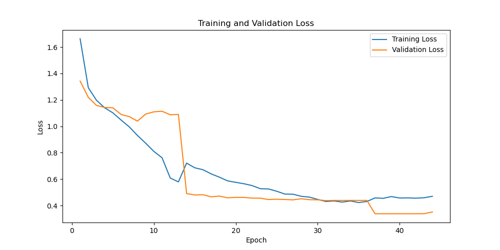

# Bird-Name-Detection

After traning model the train & val loss was overfitting
    Knowledge :

    As per Andrew NG, 
    Suppor your algorithm performs as follows: 

        * Traning error = 1%
        * dev error = 11%

From this image and knowledge we can say the bias is 1% and variance as 10%(11%-1%). Thus it has variance.

So solve the variance problem. I  have added dropout.(reduces the variance but increases bias.)

after reducing model complextity with training model with fold regulatization dropout we were able to reach accuracy 97% in validation but it was underfitting. so in the next i am training to decide

checkpoints/bird_name_classification_bs_32_lr_0.001_epochs_100_device_cpu_droupout_0.2_cvfold_5_l2regularization_0.01.pt

Yes, after reducing complexity in the model the model performed well. 

  

To run the project, you need to follow these steps:

    1. Comment and Uncomment the necessary parts: Open the run.sh file and make sure to comment or uncomment the necessary lines based on your requirements. This may include setting environment variables, activating a virtual environment, and running the Flask application.

    2. Open a terminal: Open a terminal or command prompt on your machine.

    3. Navigate to the project directory: Use the 'cd' command to navigate to the directory where your project files are located. For example, if your project is in a folder named bird_classification,

    4. Run the run.sh script in terminal run "bash run.sh"
    This will run the script and start the Flask application.

    5. Access the application: Once the Flask application is running, you can access it in your web browser by entering the URL http://localhost:5000/ or http://127.0.0.1:5000/.

  
Make sure to follow the instructions provided in the run.sh script and update any necessary configurations or dependencies based on your project setup.